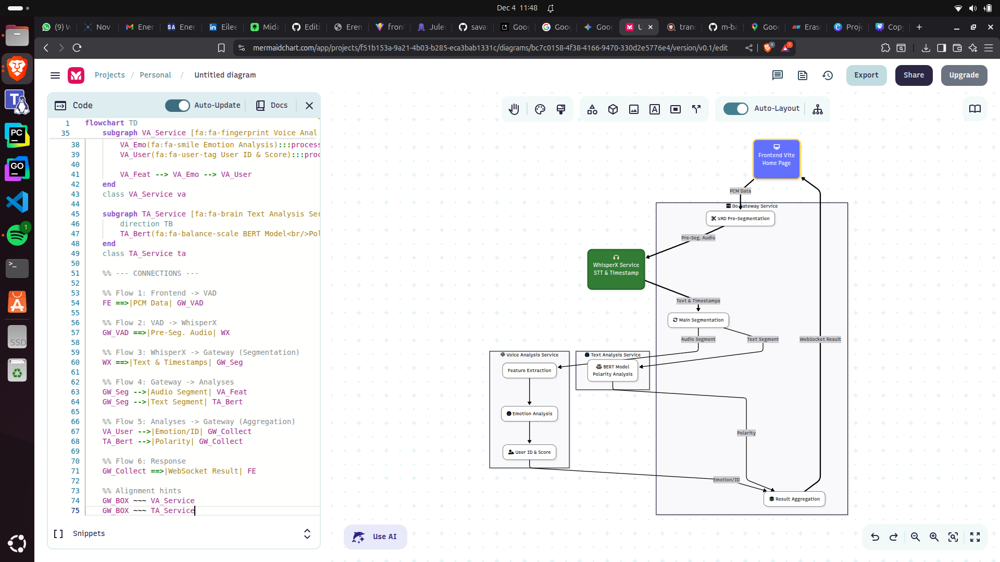
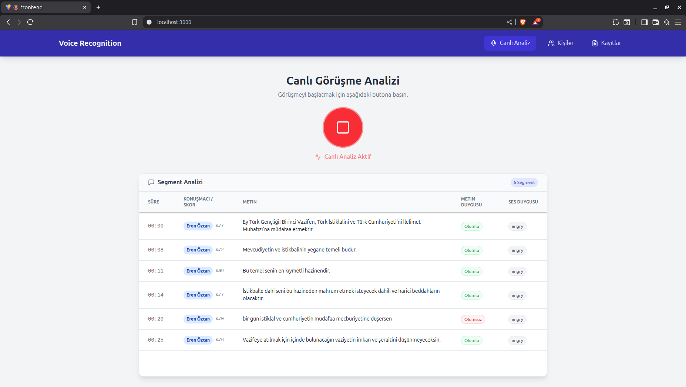
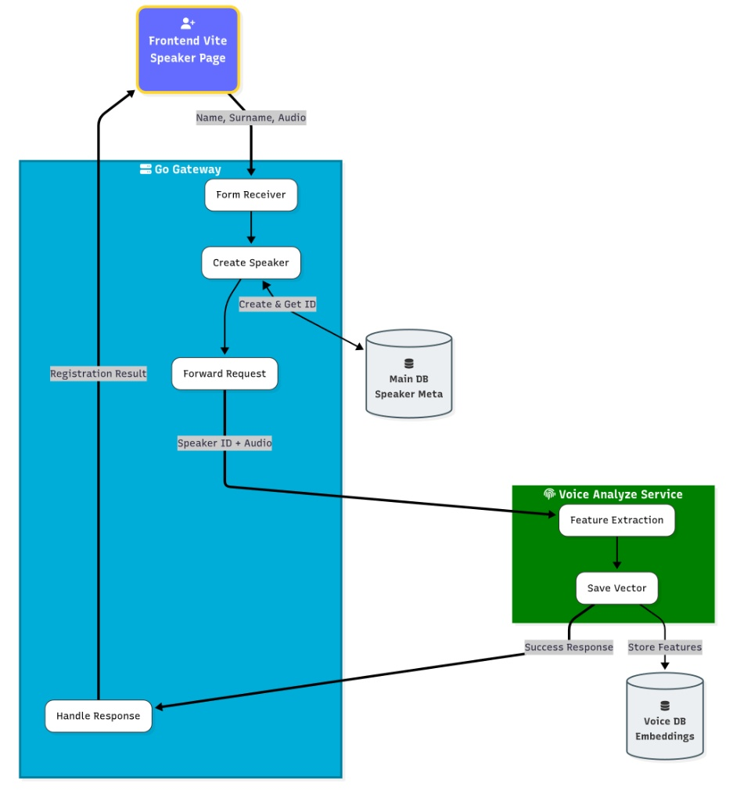
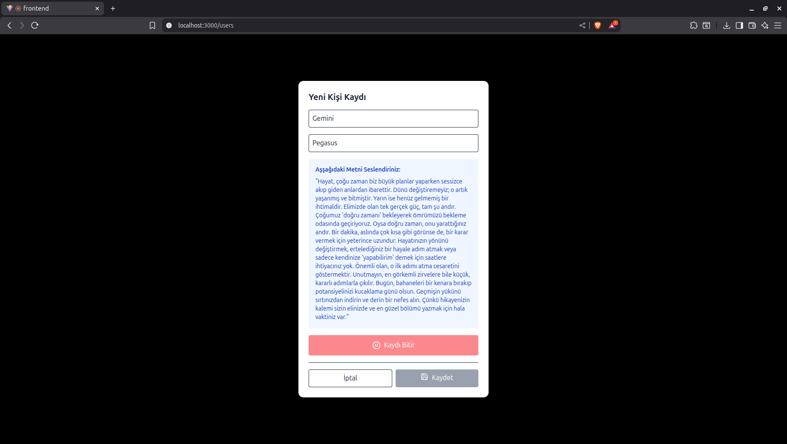
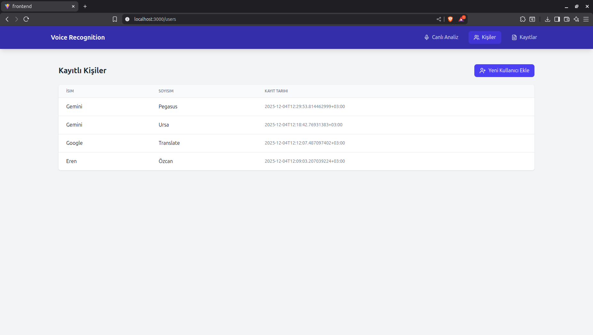

# Real-Time Voice and Sentiment Analysis System

This project is a comprehensive voice analysis system developed using microservice architecture, featuring real-time speech-to-text (STT), speaker diarization, sentiment analysis, and speaker identification capabilities.

## Architectures and Workflows

### 1. Live Audio Analysis

This module captures audio during a live conversation, transcribes it into text, separates speakers, and performs sentiment analysis based on both the text content and the tone of voice.

**Workflow Logic:**
1.  **Frontend (Vite):** Audio recording is initiated via the user interface, and audio data is streamed.
2.  **Go Gateway Service:** Receives the incoming audio data and routes it to the relevant services.
3.  **WhisperX Service:** Processes the audio to transcribe it (Speech-to-Text) and performs diarization. It determines which sentence was spoken by whom.
4.  **Text Analysis Service:** Performs sentiment analysis (Positive, Negative, Neutral) on the transcribed text.
5.  **Voice Analysis Service:** Analyzes audio segments to detect the speaker's current emotional state (e.g., Angry, Happy) and their identity.
6.  **Result:** All analysis results are aggregated and sent back to the Frontend in real-time to be displayed in the table.

**Screenshot:**
An example of the live analysis screen can be seen below.

---

### 2. User Registration

In order for the system to recognize speakers (Speaker Identification), users must register with the system using voice samples.

**Workflow Logic:**
1.  **Frontend:** The user enters their Name and Surname and reads the specified text aloud.
2.  **Go Gateway:** Receives the form data and the audio file.
    * Saves user metadata (Name, Surname, etc.) to the **Main DB (Speaker Meta)**.
    * Forwards the audio file to the analysis service.
3.  **Voice Analyze Service:**
    * Performs Feature Extraction on the incoming audio.
    * Saves the user's voice signature (vector) to the **Voice DB (Embeddings)**.
4.  **Result:** A success message is returned to the user once the registration process is complete.

**Screenshots:**
The user registration form and the list of registered persons are shown below.

*New Person Registration:*

*Registered Persons List:*

